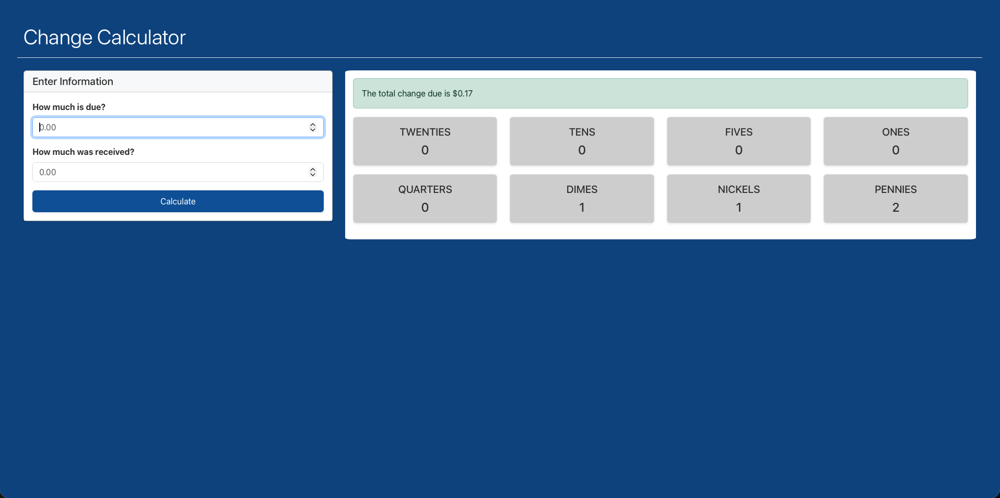
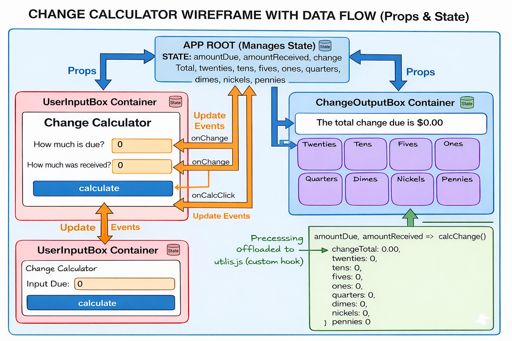
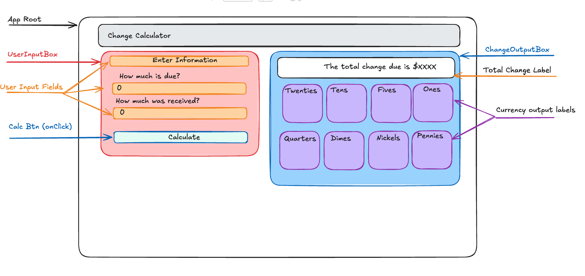

# 💰Change Calculator
A professional-grade financial utility built with **React** and a custom-architected **JavaScript Math Engine**. This project solves the common "floating-point error" problem in web development by utilizing integer-based arithmetic.

## 🏗️ Technical Architecture

### 1. The Logic Engine (`changeMath.js`)
Instead of nesting math inside components, I built a standalone utility library:
- **Integer Precision**: All calculations are performed in cents (`Math.round`) to prevent "Ghost Penny" errors common in decimal math.
- **Modulo Logic**: Uses the remainder operator (`%`) to efficiently break down totals into the largest possible denominations.
- **Single Source of Truth**: Coin definitions are managed in a central `constants.js` file, making the app 100% scalable for other currencies.

### 2. Defensive Programming (Security)
To ensure data integrity, I implemented two layers of protection:
- **Keyboard Bouncer**: An `onKeyDown` handler blocks invalid scientific notation keys (`e`, `E`, `+`, `-`) at the hardware level.
- **Regex Sanitization**: A secondary `replace(/[eE+-]/g, '')` filter catches "sneaky" data entered via copy-paste.

### 3. Component Hierarchy
- `App`: Manages the global state (`denominations`) and orchestrates the calculation flow.
- `UserInputBox`: A controlled component using **Bootstrap** for a responsive, mobile-first layout.
- `ChangeOutputBox`: A stateless component that maps through the data package to render dynamic cards and outcome alerts.

## 🚀 Features
- **Real-Time Calculation**: State updates instantly upon submission with no page refresh.
- **outcome Alerts**: Uses conditional rendering to display `alert-success` for change due or `alert-danger` for additional money owed.
- **Bootstrap 5 UI**: Fully responsive grid system (4x8 column split) for a professional desktop and mobile experience.

## 🛠️ Getting Started
1. **Clone the Repo**: `git clone ...`
2. **Install Dependencies**: `npm install`
3. **Run the App**: `npm start`
4. **Run Tests**: `npm test` (Verified 8/8 Passing ✅)

### Final Application

  

### Data Flow Diagram

  

### Component Wireframe

  

